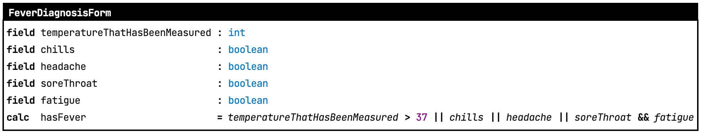

# ChatGPT in MPS

This is a demonstrator of an integration of ChatGPT in MPS. The idea is that users specify their model in prose, and ChatGPT produces the source code. 

## What this does

Click on this picture to see a [demo video you Youtube](http://www.youtube.com/watch?v=R6uoaxVV_2s).

## Installation

* This is an MPS project that needs to be opened in [MPS](http://jetbrains.com/mps/) version 2021.3.2
* Create a directory on your drive; say it's called `demo`
* Clone the reposistory into the `chatgptdemo` directory inside `demo`
* Make sure you have the [mbeddr.platform](https://github.com/mbeddr/mbeddr.core) and [IETS3.opensource](https://github.com/orgs/IETS3/packages?repo_name=iets3.opensource) libraries installed in your MPS installation; alternatively, put these into a `lib`
 folder under `demo` and make the `chatgptdemo` path variable in MPS point to `demo`
* Open the chatgptdemo project in MPS and rebuild everything for validation of the setup.

## ChatGPT Setup

ChatGPT has a bunch of configuration parameters that you'll have to set; they can all be configured at the top of the [ChatGPTInterface](http://127.0.0.1:63320/node?ref=r%3A35c2f771-4c4b-42b3-94cb-a9782f45afc3%28de.voelter.chatgpt.ide.plugin%29%2F7366371879940263257) class.

* `CHATGPT_ENDPOINT`: the service endpoint. As of this writing, this can be left unchanged.
* `CHATGPT_MODEL`: the model used by ChatGPT. Currently this is set to `gpt-3.5-turbo`. If you have access to more recent models, you might want to try changing this to get better results.
* `CHATGPT_API_KEY`: your personal API key. You *have* to change this one. [Get an API key here](https://platform.openai.com/account/api-keys).

## Background

I have been working for years and years with subject matter experts,
people who are not programmers but need to specify the core subject
matter of a domain in a way that is formal and complete enough to allow
direct execution by software. You can't teach them a general-purpose
language, because it is too low-level and too burdened with technical
concerns that are unrelated to the subject matter at hand. Instead, I
follow an approach based on the [Subject Matter First
Manifesto](http://subjectmatterfirst.org), where software developers
create domain-specific languages and tools that allow the subject matter
experts to {program|model|specify} the subject matter formally. [I have
helped many companies use this approach in practice](http://voelter.de),
at real-world scale. It works.

However, there has been a long standing dream by which these subject
matter experts aren't required to express themselves in any formal
language, domain-specific or not. Instead, why not just express what the
system should do in prose. There are lots of tradeoffs here, which I
describe in detail in an article that I will publish soon. The bottom
line is that for the subject matter experts use case, I think letting
the AI translate the prose into a DSL is better than having it translate
directly into programming language source code. The code in this
repository demos this approach. 

The approach demonstrated here is of course technically specific to MPS.
The conceptual approach is not. In fact, if a real textual DSL was used
(instead of the projection technology provided by MPS) then the
translation between nodes and XML (see below) would not be needed.

## Brief technical overview

The code is separated into a demo application (in the `lang.demo`
virtual folder) and a generic, reusable set of utilities (in the
`lang.chatgpt` virtual folder). The demo application focuses on forms
with fields and calculated values; such forms are used, for example, as
assessments in healthcare. Here is an example: 

The language also includes tests for forms that can be executed in
MPS with the help of an interpreter:

For more details on the example domain see the video above. The forms
language uses [KernelF](http://voelter.de/data/pub/kernelf-icmt.pdf) for
expressions.

The forms language is a normal MPS DSL; it currently has a few technical dependencies on the generic ChatGPT framework, for 
example [here](http://127.0.0.1:63320/node?ref=r%3Ac7c9bfe3-9ccc-4f4b-8119-d743191d3321%28de.voelter.forms.behavior%29%2F8008715273083516240) or [here](http://127.0.0.1:63320/node?ref=r%3A23c80d5c-ce08-4524-8f3c-b2b1fdbe09d4%28de.voelter.forms.structure%29%2F4253771607368430228).
(The previous link and many of those below are MPS node URLs; click on them while the project is open in MPS to jump directly to the code).

* The user enters a prompt into the [Swing UI](http://127.0.0.1:63320/node?ref=r%3A35c2f771-4c4b-42b3-94cb-a9782f45afc3%28de.voelter.chatgpt.ide.plugin%29%2F8008715273089219580) that is shown at the bottom of the [ChatGPTConsole](http://127.0.0.1:63320/node?ref=r%3A133a7418-d1e8-4856-8f06-72120ccfc56b%28de.voelter.chatgpt.util.structure%29%2F4253771607368385351).
* The system [sends](http://127.0.0.1:63320/node?ref=r%3A35c2f771-4c4b-42b3-94cb-a9782f45afc3%28de.voelter.chatgpt.ide.plugin%29%2F7366371879941258164) the following to ChatGPT:
  - [system messages](http://127.0.0.1:63320/node?ref=r%3A35c2f771-4c4b-42b3-94cb-a9782f45afc3%28de.voelter.chatgpt.ide.plugin%29%2F8008715273062010493) that instruct GPT to only respond with XML code, no prose, no explanations
  - a set of user messages that [explains the XML structures](http://127.0.0.1:63320/node?ref=r%3A35c2f771-4c4b-42b3-94cb-a9782f45afc3%28de.voelter.chatgpt.ide.plugin%29%2F8008715273062305834) that we use to express the forms (we use XML as the common denominator between MPS and ChatGPT)
    this "tutorial" is written as a [text file](languages/de.voelter.forms/tutorial/tutorial.txt). 
  - the history of the MPS-ChatGPT interactions so far as a means of emulating a stateful conversation (see below)
  - the prompt entered by the user
* ChatGPT sends back a [new form expressed as XML](http://127.0.0.1:63320/node?ref=r%3A35c2f771-4c4b-42b3-94cb-a9782f45afc3%28de.voelter.chatgpt.ide.plugin%29%2F7366371879941258230)
* We [parse the XML](http://127.0.0.1:63320/node?ref=r%3Ac7c9bfe3-9ccc-4f4b-8119-d743191d3321%28de.voelter.forms.behavior%29%2F8008715273065432720) and build the MPS model
  The demo-language-specific config node [acts as a factory](http://127.0.0.1:63320/node?ref=r%3Ad481c127-603a-4645-9a8f-b02ec70fa5c8%28de.voelter.chatgpt.util.behavior%29%2F4253771607368385319) for the parser.
  If ChatGPT makes up syntax that was not defined in the tutorial, we cannot parse it. We capture these problems in
  the created model with [annotations](http://127.0.0.1:63320/node?ref=r%3A133a7418-d1e8-4856-8f06-72120ccfc56b%28de.voelter.chatgpt.util.structure%29%2F8008715273065551114) and error concepts for [expressions](http://127.0.0.1:63320/node?ref=r%3A133a7418-d1e8-4856-8f06-72120ccfc56b%28de.voelter.chatgpt.util.structure%29%2F8008715273068044372) and [types](http://127.0.0.1:63320/node?ref=r%3A133a7418-d1e8-4856-8f06-72120ccfc56b%28de.voelter.chatgpt.util.structure%29%2F8008715273083708576).
* The ChatGPTConsole does not just store the latest form; instead it [stores the history](http://127.0.0.1:63320/node?ref=r%3A133a7418-d1e8-4856-8f06-72120ccfc56b%28de.voelter.chatgpt.util.structure%29%2F4253771607368385352) (see also the video).
  The prompt and the textual reply is [stored as an annotation](http://127.0.0.1:63320/node?ref=r%3A133a7418-d1e8-4856-8f06-72120ccfc56b%28de.voelter.chatgpt.util.structure%29%2F8008715273072263102) on each of the constructed forms.
* Importantly, when we send back the history, we do *not* send back the XML that we received from ChatGPT before.
  Instead we [serialise the MPS model back to XML](http://127.0.0.1:63320/node?ref=r%3Ac7c9bfe3-9ccc-4f4b-8119-d743191d3321%28de.voelter.forms.behavior%29%2F8008715273082739421). If the user did not make changes to the model after it was
  received from ChatGPT, this does not make a difference. But it does make a difference if the user made a change:
  we make it appear as if ChatGPT suggested this change, which allows ChatGPT to make subsequent changes on 
  the basis for the model changed by the user.

## License

This code is licensed under Apache 2.0. See [LICENSE](LICENSE) file.
